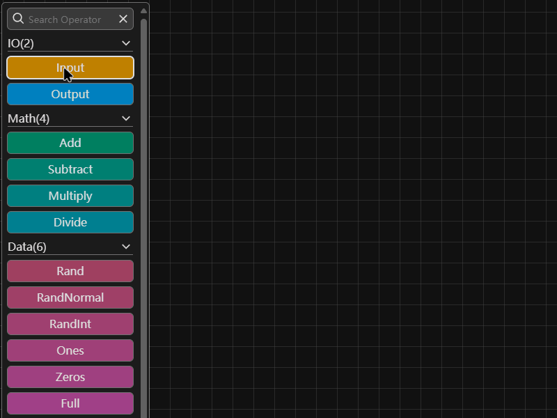

# `flowing` 使用说明 `flowing` Instruction

注意：由于项目正在不断迭代，本说明可能包含过时的演示动画，请以实际呈现为准。
 
Note: Because the project is in continuous iteration, this instruction may contain outdated demonstration animations, please refer to the actual presentation.

## 设计网络结构 Build Network Structure

- 通过分类列表、搜索框寻找需要的算子。 Find what you need in the operator bar, or try to search them directly.

  

- 按住鼠标左键并拖动左侧节点栏中的节点模板，松开后可将节点添加到画布指定位置中。 Hold down the left mouse button and drag the node template in the left operation bar. Release the button and create node to the specified position in the canvas.
  
  

- 单击鼠标左键点击画布中的节点，在右侧弹出的配置框中配置节点属性。 Click the left mouse button on the node in the canvas, and configure the node properties in the configuration box that pops up on the right.

  

- 按住鼠标左键并拖动画布中的节点，可改变节点的位置。 Hold down the left mouse button and drag the node in the canvas to change the position of the node.

  

- 按住鼠标左键并拖动画布中的节点的输出端点（下方端点）到其余节点的输入端点（上方端点），松开后可建立两个节点的数据流。 Hold down the left mouse button and drag the output endpoint (at the lower end) of the node in the canvas to the input endpoint (at the upper end) of another node. Release the button to establish the data flow between the two nodes.

  

- 按住鼠标左键并拖动画布中的节点的输入端点（上方端点）到空白处即可断开节点间的数据流；到另一个输入端点（上方端点）即可调整数据流。 Hold down the left mouse button. Drag the input endpoint (at the upper end) of a node, which is connected to an output endpoint (at the lower end), to the blank area of the canvas. Release the button to cancel the data flow between the two nodes. Or, drag it to another input endpoint (at the upper end) and release the button to change the data flow.

  

## 设计辅助 Design Aids

- 点击算子名称，查看算子介绍。 Click on the name of the operator to see the introduction to the operator.

  

- 点击提示推测错误的连线Shape信息，查看错误原因帮助修正模型。 Click on the prompt which inferring the incorrect Shape of connection, to view the error reason and help correct the model.

  

- 点击`tidy`按钮，自动整理画布中的节点。 Click the `tidy` button to automatically organize the nodes in the canvas.

  

- 点击`generate network`按钮，进入网络图生成界面，按以下步骤可完成生成任务或网络修改任务： Click the `generate network` button to enter the network diagram generation interface, follow the steps below to complete the generation task or network modification task:
  1. 填入/选择`base url`、`api key`、`module`，这些值可以在各`api`供应商的文档或控制台中找到。 Fill/Select `base url`, `api key`, `module`, these values can be found in each `api` vendor's documentation or console.
  2. `prompt`由平台自动生成，也可以选择自行附加或修改。 `prompt` is automatically generated by the platform, or you can choose to attach or modify it yourself.
  3. 在`query`填入需求，并点击`send`开始生成。 Fill in the requirements in the `query` and click `send` to start generating.
  4. 等待生成完毕。 Wait for the generation to complete.

## 画布操作指南 Canvas Operation Guide

- 点击`move`按钮或`select`按钮，切换画布拖动模式。 Click the `move` or `select` button to switch the mode of dragging canvas.

  

- 按住`ctrl`键，按住鼠标左键并拖动画布时将短暂反转画布拖动模式。 Holding down the `ctrl` key while holding down the left mouse button and dragging the canvas will briefly reverse the mode of dragging canvas.

  

- 在`move`模式下，按住鼠标左键并拖动画布，可改变视窗位置。 Hold down the left mouse button and drag the canvas to change the position of the viewport on the `move` mode.

  

- 在`select`模式下，按住鼠标左键并拖动画布，可框选画布中的节点。 Hold down the left mouse button and drag the canvas to select nodes in the canvas on the `select` mode.

  

- 在画布空白区域按住键盘Ctrl键并滚动鼠标滚轮，可缩放视窗。 Hold down the Ctrl key on the keyboard and scroll the mouse wheel in the blank area of the canvas to zoom in or out of the viewport.

  

- 按住鼠标左键并拖动右侧地图，可移动视窗。 Hold down the left mouse button and drag the map on the right to move the viewport.

  

- 点击`clear`按钮，清空画布。  Click the `clear` button to clear the canvas.

  

## 生成网络结构 Generate Network Code

- 完成网络定义后，点击`calculate`按钮，生成代码文件。 After completing the network definition, click the `calculate` button to generate the code file.

  

## 更多进阶技巧 More Advanced Tricks

- 单击鼠标右键点击画布中的节点/单击鼠标右键点击画布空白位置，弹出右键菜单。 Click the right mouse button on the node in the canvas or the blank area of the canvas to pop up the right-click menu.

  

- 按住键盘Ctrl键并单击鼠标左键点击画布中的节点，可多选节点。 Hold down the Ctrl key on the keyboard and click the left mouse button on the node in the canvas to multi-select nodes.

  

- 点击`export`按钮，导出画布中的节点、节点参数及连接结构。 Click the `export` button to export the nodes, node's parameters, and connection structure in the canvas.

  

- 点击`import`按钮，导入先前导出的节点、节点参数及连接结构。 Click the `import` button to import the previously exported nodes, nodes parameters, and connection structure.

  您可以在[这里](../example/flowing/web/)找到一些示例。 You can find some examples in [here](../example/flowing/web/).

  

## 支持的算子 Supported Operators

| 算子名称Name                 | 算子平台名称PMoS Name | 支持版本Supported Version |
| ---------------------------- | --------------------- | ------------------------- |
| torch.cat/torch.concat       | Cat                   | >=0.1.a202501             |
| torch.full                   | Full                  | >=0.1.a202501             |
| torch.full_like              | FullLike              | >=0.1.a202501             |
| torch.AdaptiveAvgPool1d      | AdaptiveAvgPool1d     | >=0.1.a202503             |
| torch.AdaptiveAvgPool2d      | AdaptiveAvgPool2d     | >=0.1.a202503             |
| torch.AdaptiveAvgPool3d      | AdaptiveAvgPool3d     | >=0.1.a202503             |
| torch.AdaptiveMaxPool1d      | AdaptiveMaxPool1d     | >=0.1.a202503             |
| torch.AdaptiveMaxPool2d      | AdaptiveMaxPool2d     | >=0.1.a202503             |
| torch.AdaptiveMaxPool3d      | AdaptiveMaxPool3d     | >=0.1.a202503             |
| torch.nn.AlphaDropout        | AlphaDropout          | >=0.1.a202503             |
| torch.nn.AvgPool1d           | AvgPool1d             | >=0.1.a202503             |
| torch.nn.AvgPool2d           | AvgPool2d             | >=0.1.a202503             |
| torch.nn.AvgPool3d           | AvgPool3d             | >=0.1.a202503             |
| torch.nn.BatchNorm1d         | BatchNorm1d           | >=0.1.a202501             |
| torch.nn.BatchNorm2d         | BatchNorm2d           | >=0.1.a202501             |
| torch.nn.BatchNorm3d         | BatchNorm3d           | >=0.1.a202501             |
| torch.nn.Bilinear            | Bilinear              | >=0.1.a202503             |
| torch.nn.CELU                | CELU                  | >=0.1.a202501             |
| torch.nn.Conv1d              | Conv1d                | >=0.1.a202501             |
| torch.nn.Conv2d              | Conv2d                | >=0.1.a202501             |
| torch.nn.Conv3d              | Conv3d                | >=0.1.a202501             |
| torch.nn.ConvTranspose1d     | ConvTranspose1d       | >=0.1.a202501             |
| torch.nn.ConvTranspose2d     | ConvTranspose2d       | >=0.1.a202501             |
| torch.nn.ConvTranspose3d     | ConvTranspose3d       | >=0.1.a202501             |
| torch.nn.Dropout             | Dropout               | >=0.1.a202501             |
| torch.nn.Dropout1d           | Dropout1d             | >=0.1.a202501             |
| torch.nn.Dropout2d           | Dropout2d             | >=0.1.a202501             |
| torch.nn.Dropout3d           | Dropout3d             | >=0.1.a202501             |
| torch.nn.ELU                 | ELU                   | >=0.1.a202503             |
| torch.nn.GELU                | GELU                  | >=0.1.a202503             |
| torch.nn.GroupNorm           | GroupNorm             | >=0.1.a202501             |
| torch.nn.Hardshrink          | Hardshrink            | >=0.1.a202503             |
| torch.nn.Hardsigmoid         | Hardsigmoid           | >=0.1.a202503             |
| torch.nn.Hardtanh            | Hardtanh              | >=0.1.a202503             |
| torch.nn.Identity            | Identity              | >=0.1.a202503             |
| torch.nn.LayerNorm           | LayerNorm             | >=0.1.a202501             |
| torch.nn.LazyBatchNorm1d     | LazyBatchNorm1d       | >=0.1.a202503             |
| torch.nn.LazyBatchNorm2d     | LazyBatchNorm2d       | >=0.1.a202503             |
| torch.nn.LazyBatchNorm3d     | LazyBatchNorm3d       | >=0.1.a202503             |
| torch.nn.LazyConv1d          | LazyConv1d            | >=0.1.a202501             |
| torch.nn.LazyConv2d          | LazyConv2d            | >=0.1.a202501             |
| torch.nn.LazyConv3d          | LazyConv3d            | >=0.1.a202501             |
| torch.nn.LazyConvTranspose1d | LazyConvTranspose1d   | >=0.1.a202501             |
| torch.nn.LazyConvTranspose2d | LazyConvTranspose2d   | >=0.1.a202501             |
| torch.nn.LazyConvTranspose3d | LazyConvTranspose3d   | >=0.1.a202501             |
| torch.nn.LazyLinear          | LazyLinear            | >=0.1.a202501             |
| torch.nn.LeakyReLU           | LeakyReLU             | >=0.1.a202501             |
| torch.nn.Linear              | Linear                | >=0.1.a202501             |
| torch.nn.LogSigmoid          | LogSigmoid            | >=0.1.a202503             |
| torch.nn.LogSoftmax          | LogSoftmax            | >=0.1.a202503             |
| torch.nn.MaxPool1d           | MaxPool1d             | >=0.1.a202501             |
| torch.nn.MaxPool2d           | MaxPool2d             | >=0.1.a202501             |
| torch.nn.MaxPool3d           | MaxPool3d             | >=0.1.a202501             |
| torch.nn.MaxUnpool1d         | MaxUnpool1d           | >=0.1.a202501             |
| torch.nn.MaxUnpool2d         | MaxUnpool2d           | >=0.1.a202501             |
| torch.nn.MaxUnpool3d         | MaxUnpool3d           | >=0.1.a202501             |
| torch.nn.Mish                | Mish                  | >=0.1.a202503             |
| torch.nn.PReLU               | PReLU                 | >=0.1.a202503             |
| torch.nn.ReLU                | ReLU                  | >=0.1.a202501             |
| torch.nn.ReLU6               | ReLU6                 | >=0.1.a202503             |
| torch.nn.SELU                | SELU                  | >=0.1.a202501             |
| torch.nn.SiLU                | SiLU                  | >=0.1.a202503             |
| torch.nn.Sigmoid             | Sigmoid               | >=0.1.a202501             |
| torch.nn.Softmax             | Softmax               | >=0.1.a202501             |
| torch.nn.Softmax2d           | Softmax2d             | >=0.1.a202503             |
| torch.nn.Softmin             | Softmin               | >=0.1.a202503             |
| torch.nn.Softplus            | Softplus              | >=0.1.a202503             |
| torch.nn.Softshrink          | Softshrink            | >=0.1.a202503             |
| torch.nn.Softsign            | Softsign              | >=0.1.a202503             |
| torch.nn.Tanh                | Tanh                  | >=0.1.a202503             |
| torch.nn.Tanhshrink          | Tanhshrink            | >=0.1.a202503             |
| torch.nn.Threshold           | Threshold             | >=0.1.a202503             |
| torch.nn.FeatureAlphaDropout | FeatureAlphaDropout   | >=0.1.a202503             |
| torch.nn.Flatten             | Flatten               | >=0.1.a202501             |
| torch.nn.Unflatten           | Unflatten             | >=0.1.a202501             |
| torch.ones                   | Ones                  | >=0.1.a202501             |
| torch.ones_like              | OnesLike              | >=0.1.a202501             |
| torch.permute                | Permute               | >=0.1.a202501             |
| torch.rand                   | Rand                  | >=0.1.a202501             |
| torch.rand_like              | RandLike              | >=0.1.a202501             |
| torch.randint                | RandInt               | >=0.1.a202501             |
| torch.randint_like           | RandIntLike           | >=0.1.a202501             |
| torch.randn                  | RandNormal            | >=0.1.a202501             |
| torch.randn_like             | RandNormalLike        | >=0.1.a202501             |
| torch.reshape                | Reshape               | >=0.1.a202501             |
| torch.squeeze                | Squeeze               | >=0.1.a202501             |
| torch.stack                  | Stack                 | >=0.1.a202501             |
| torch.transpose              | Transpose             | >=0.1.a202501             |
| torch.unsqueeze              | Unsqueeze             | >=0.1.a202501             |
| torch.zero_like              | ZeroLike              | >=0.1.a202501             |
| torch.zeros                  | Zeros                 | >=0.1.a202501             |
